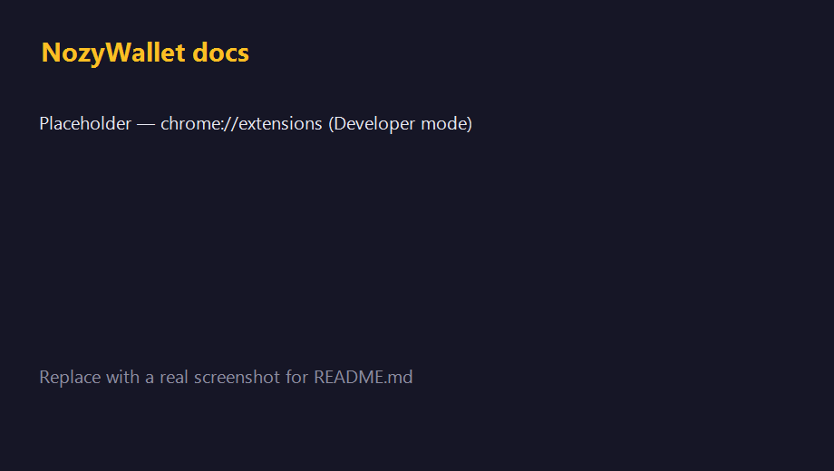
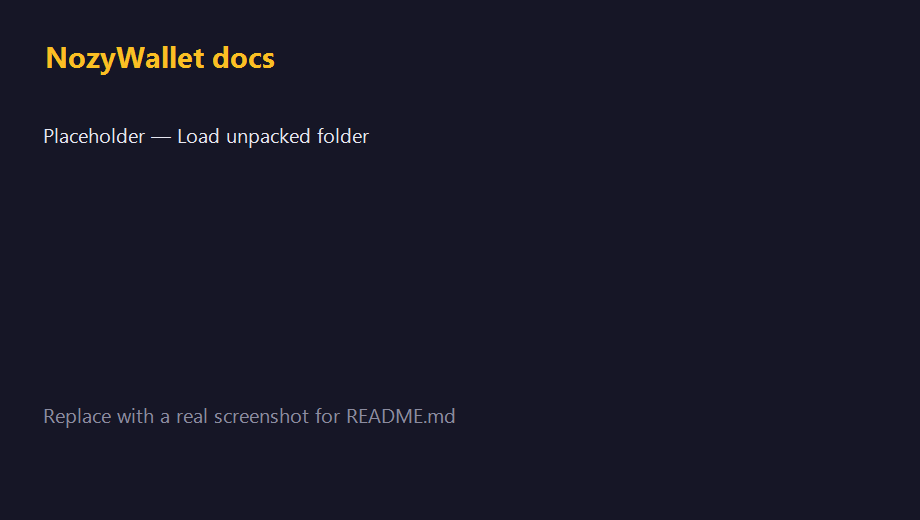
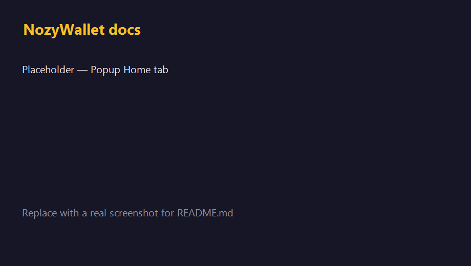
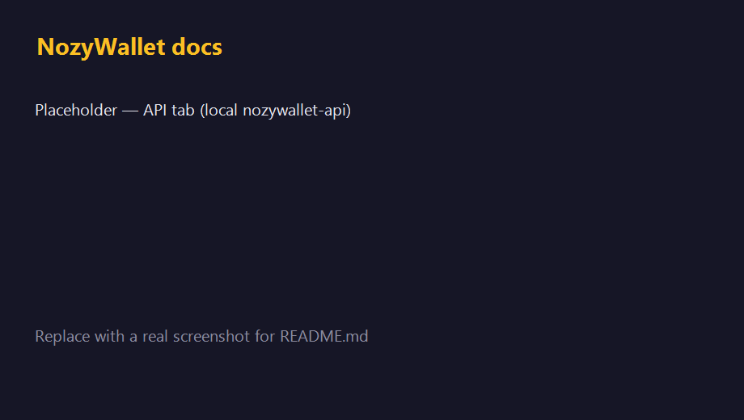
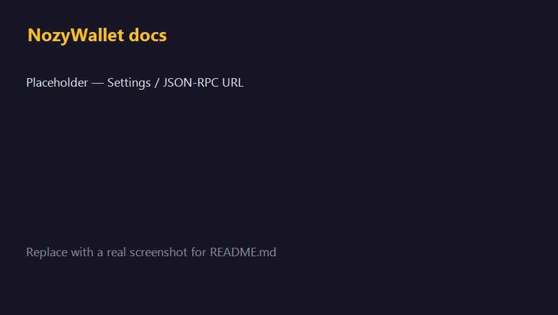

# NozyWallet browser extension (Manifest V3)

**Primary entry point for most users:** install **[Nozy Desktop](https://github.com/LEONINE-DAO/Nozy-wallet/releases)** (Tauri) — full Orchard wallet, Zebra JSON-RPC, and the smoothest path for shielded sends as the stack matures.

This **extension** is the **lighter path**: Orchard-related crypto runs as **WASM** in the extension, while **compact block sync** can use a small **local HTTP API** (`nozywallet-api`, same routes as the desktop app) talking to **lightwalletd**. You do **not** need Zebrad on the same PC for that sync workflow—only a reachable **lightwalletd** (default in docs: `http://127.0.0.1:9067`).

The **marketing `landing/` site is not the wallet**; use Desktop or this extension.

---

## Screenshots (placeholders)

Add images under [`docs/screenshots/`](docs/screenshots/) and refresh this section.

| Step | Image |
|------|--------|
| 1. Extensions page, Developer mode on |  |
| 2. Load unpacked → select extracted folder |  |
| 3. Extension pinned; open popup |  |
| 4. **API** tab — Check API / compact sync |  |
| 5. Settings — Zebra / JSON-RPC for in-extension scan & broadcast |  |

*Current files are **labeled placeholders** (dark background). Swap in real screenshots using the same paths.*

---

## Install (Chrome, Edge, Brave)

### 1. Get a release zip

- **Recommended:** open **[Latest release](https://github.com/LEONINE-DAO/Nozy-wallet/releases/latest)** → **Assets** → download `nozy-extension-chromium.zip` (or the versioned `nozy-extension-chromium-*.zip`). The bare URL `…/releases/latest/download/nozy-extension-chromium.zip` **404s** if CI has not attached that file to the current latest release yet.
- Or browse **[all releases](https://github.com/LEONINE-DAO/Nozy-wallet/releases)** and pick a tag that lists the zip (see **`RELEASES.md`**).
- Extract the zip to a folder (e.g. `nozy-extension`).

### 2. Load unpacked

**Chrome:** `chrome://extensions` → enable **Developer mode** → **Load unpacked** → choose the extracted `nozy-extension` folder (the one that contains `manifest.json`).

**Edge:** `edge://extensions` → **Developer mode** → **Load unpacked** → same folder.

### 3. Pin the extension

Use the puzzle icon → pin **NozyWallet** so the popup is one click away.

### 4. Local API (optional but recommended for lightwalletd sync)

1. Run **`nozywallet-api`** from the repo (see [`api-server`](../api-server)) or use **Nozy Desktop**, which exposes the same **LWD** helpers.
2. Default API URL: `http://127.0.0.1:3000`.
3. In the popup, open the **API** tab, confirm the URL, click **Check API**.

Details: [`COMPANION.md`](COMPANION.md), [`LOCAL_RPC.md`](LOCAL_RPC.md).

### 5. JSON-RPC node (Zebra or other)

For **in-extension** block scan and `sendrawtransaction`, set **RPC endpoint** in **Settings** (default `http://127.0.0.1:8232`). Zebrad must allow your machine to POST JSON-RPC (see Zebra cookie/auth docs).

---

## Development build

```bash
# WASM (writes browser-extension/wasm/pkg)
cd browser-extension/wasm-core
curl https://rustwasm.github.io/wasm-pack/installer/init.sh -sSf | sh   # once
wasm-pack build --target web --out-dir ../wasm/pkg --release

# Popup
cd popup
npm ci
npm run build
```

Load **`browser-extension/`** as unpacked in Chrome (paths in `manifest.json` must match `wasm-core/popup/dist`).

Or use [`scripts/package-extension.sh`](scripts/package-extension.sh) to produce a clean tree under `dist/`.

---

## GitHub Actions

| Workflow | When | Output |
|----------|------|--------|
| **`extension-ci.yml`** | PR / push touching `browser-extension/` | WASM build, popup test/build, packaged tree artifact |
| **`extension-release.yml`** | **Published GitHub Release** (any tag) **or** manual **Run workflow** | `nozy-extension-chromium-<manifestVersion>.zip` + Firefox copy, uploaded to the release |

**CRX:** CI does **not** produce signed **`.crx`** files (Chrome needs a private key). Use the **zip** with **Load unpacked**, or publish to **Chrome Web Store** / **Edge Add-ons** (zip upload). See [`STORE_SUBMISSION_CHECKLIST.md`](STORE_SUBMISSION_CHECKLIST.md) if present.

---

## Security notes

- The extension requests **broad `host_permissions`** so the in-page provider can talk to user-configured RPC URLs and dApp origins. Review **`manifest.json`** before install.
- **Mnemonic** handling stays in the extension + service worker; the **companion API** does not receive your seed.

---

## More docs

- [`CHANGELOG.md`](CHANGELOG.md)
- [`RELEASES.md`](RELEASES.md)
- [`COMPANION.md`](COMPANION.md)
