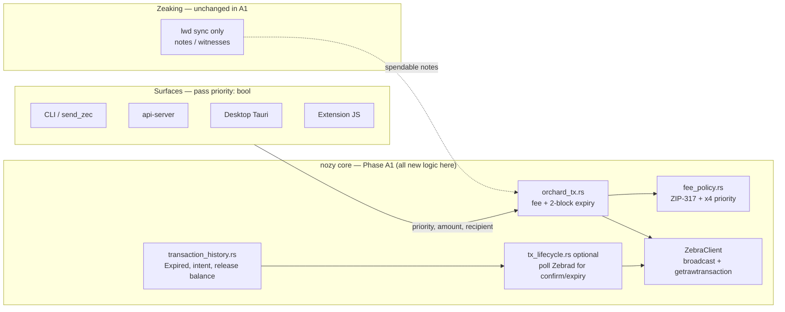

# Dynamic Fee Pilot — Phase A implementation plan (review)

**Status:** A1 shipped in **v2.3.0** (CLI + api-server + desktop native surfaces); speed-up / Expired polling / extension WASM next  
**Parent RFC:** [DYNAMIC_FEE_PILOT_PLAN.md](DYNAMIC_FEE_PILOT_PLAN.md) (architecture + Shielded Labs pilot alignment)  
**Stack:** Zebrad-only + lightwalletd via Zeaking for sync; **no `zcashd`**

This document is the **actionable checklist** for Phase A. It reflects the post–working-session decision:

> **Start pilot behavior in the NozyWallet core and surfaces first.**  
> **Defer all Zeaking crate work** (`fee_policy`, observatory, compact-stream expiry detection) **until Shielded Labs gives the go-ahead** to land shared logic in Zeaking.

---

## 1. What we are building (pilot features)

From Shielded Labs’ “Zcash Dynamic Fees, Now!” pilot — three user-visible behaviors:

| # | Feature | User sees | On-chain effect |
|---|---------|-----------|-----------------|
| 1 | **Opt-in priority** | Toggle (off by default) | Fee = standard × **4** when on |
| 2 | **Short expiry** | Tx expires in ~2 minutes if not mined | `expiry_height = tip + 2` (not ~40 blocks) |
| 3 | **Speed up** | Button after expiry | **New** tx at 4× fee + new expiry — **not** rebroadcast of same bytes |

**Why we can ship without node changes:** fees are computed **client-side** (ZIP-317); 2-block expiry is valid on Zebrad (see parent RFC §1–2).

---

## 2. Current codebase vs target (honest snapshot)

| Area | Today | Target (Phase A) |
|------|--------|------------------|
| Fee source | `estimatefee` RPC → almost always **10_000 zat** fallback on Zebrad | **ZIP-317** conventional fee in **nozy** `fee_policy` (interim; move to Zeaking later) |
| Desktop send UI | Slow / Normal / Fast with **hardcoded ZEC** amounts — **not sent to backend** | Single **priority** toggle; fee from `fee_policy` at build time |
| Expiry | `DEFAULT_TX_EXPIRY_DELTA` (~40 blocks) in `orchard_tx.rs` | Pilot default **2 blocks** (configurable constant) |
| Extension WASM | Fixed fee zats + library default expiry | Plumb **priority**, **expiry_delta**, fee from same policy as core |
| Extension speed-up | `retryBroadcastById` rebroadcasts **same** raw tx | Rebuild via core intent (recipient, amount, memo) |
| History | `Pending` / `Confirmed` / `Failed` only | Add **`Expired`**; release pending balance when expiry passes unmined |
| Zeaking | Sync/index only | **No pilot changes until SL approval** |

---

## 3. Scope split: what we do now vs what waits

### Phase A1 — **Nozy core + surfaces** (start here)

No changes under `zeaking/` until Shielded Labs approves shared-crate work.

| Workstream | Primary location | Notes |
|------------|------------------|--------|
| **`fee_policy` (interim in nozy)** | `src/fee_policy.rs` (new) | ZIP-317 standard fee + `PRIORITY_MULTIPLIER = 4`; replace `cli_helpers::estimate_transaction_fee` → `get_fee_estimate` |
| **Apply fee + expiry at build** | `src/orchard_tx.rs`, `src/transaction_builder.rs` | `BuildOptions { priority, expiry_delta }`; stop using broken RPC path for sends |
| **`Expired` + balance release** | `src/transaction_history.rs` | New status; pending notes unlocked when expiry passed and tx never confirmed |
| **Expiry / confirm polling (interim)** | `src/transaction_history.rs` or small `src/tx_lifecycle.rs` | Poll Zebrad `getrawtransaction` / tip height — **not** Zeaking compact detection yet |
| **Speed-up rebuild** | `src/orchard_tx.rs` + history linking | New tx from stored intent; mark original `Expired` |
| **Wire priority on all surfaces** | CLI, api-server, desktop Tauri, extension | See §5 file list |
| **Local pilot metrics (counts only)** | e.g. `src/pilot_metrics.rs` or extend `local_analytics` | Opt-in counters: `priority_sends`, `speed_ups`, `expired_unmined`, `speed_up_confirmed` |
| **Docs / UX copy** | Send flows | Opt-in priority; short expiry disclaimer; fingerprinting note (parent RFC §4.3) |

**Testnet first** for every item before mainnet.

### Phase A2 — **Zeaking** (blocked on Shielded Labs go-ahead)

Do **not** start until SL confirms Zeaking as the home for shared pilot primitives.

| Workstream | Primary location | Notes |
|------------|------------------|--------|
| Move `fee_policy` into Zeaking | `zeaking/src/fee_policy.rs` | Single source for CLI, api, desktop, FFI, extension WASM |
| Confirmation / expiry from compact sync | `zeaking/src/lwd/…` | Feed `Expired` without per-wallet RPC polling |
| Observatory indexer | `zeaking` + SQLite `observatory` table | Full-tx fetch for ecosystem fee/expiry stats |
| Optional: `CompactTx.fee` | lightwalletd ask (coordination with SL) | Reduces full-tx fetch cost |

After A2: delete interim duplicate in nozy and call `zeaking::fee_policy` everywhere.

### How A1 adds dynamic fees **without** Zeaking

Zeaking’s job today is **compact sync only** (lightwalletd → SQLite → scan). That stays unchanged in A1. Dynamic fees do **not** need the indexer; they need **math at tx build time** and **wallet state** for expiry/speed-up — both already live in the `nozy` crate.



**Step-by-step (one send):**

1. **User toggles priority** on desktop / CLI / API / extension → `priority: false | true` (default `false`).
2. **Fee preview** — surfaces call `nozy::fee_policy::fee_for_tx_shape(shape, priority)` (sync, no RPC). Same function used at build time so UI matches chain.
3. **Build tx** — `orchard_tx` asks `fee_policy` for zats, sets `expiry_height = tip + 2`, builds Orchard bundle (existing path).
4. **Broadcast** — `ZebraClient::sendrawtransaction` (already in nozy).
5. **History** — save `SentTransactionRecord` with `fee_zatoshis`, `expiry_height`, `priority`, recipient, amount, memo (intent for speed-up).
6. **Later** — `tx_lifecycle` (or history refresh): if `tip > expiry_height` and tx not in chain → `Expired`, release spent notes from “pending” lock.

**What we stop using for sends:**

| Old path | A1 replacement |
|----------|----------------|
| `ZebraClient::get_fee_estimate()` / `estimatefee` | `fee_policy` (ZIP-317 in nozy) |
| Desktop `FEES.slow/normal/fast` constants | Live zats from `fee_policy` + priority toggle |
| Extension `estimateFeeZats()` RPC | Same `fee_policy` via api-server or duplicated ZIP-317 in WASM build args |

**Zeaking is still used for** scanning notes and witnesses — not for fees. **Phase A2** only *moves* `fee_policy` (and optionally expiry detection) into Zeaking so FFI/extension/desktop share one crate; behavior stays the same.

### Phase B — After Shielded Labs standardization

Unchanged from parent RFC §5: canonical “standard fee” definition, shared metrics schema, optional compact `fee` field.

---

## 4. Recommended build order (A1 only)

```text
1. fee_policy (ZIP-317) + unit tests
      ↓
2. orchard_tx: BuildOptions (priority, expiry_delta) + use fee_policy
      ↓
3. transaction_history: Expired + expiry_height on record + release pending notes
      ↓
4. tx lifecycle: detect confirmed / expired_unmined (Zebrad poll)
      ↓
5. speed_up() rebuild path in core + history link (successor txid)
      ↓
6. Surfaces: priority flag + live fee estimate endpoint/command
      ↓
7. Extension: WASM expiry_delta + replace retryBroadcastById
      ↓
8. Pilot metrics (counts only) + testnet soak
```

---

## 5. File touch list (A1)

### New files (proposed)

| File | Purpose |
|------|---------|
| `src/fee_policy.rs` | `TxShape`, `standard_fee()`, `fee_for(priority)`, ZIP-317 |
| `src/pilot_metrics.rs` (optional) | Local counters, no PII |
| `docs/rfcs/DYNAMIC_FEE_PHASE_A_IMPLEMENTATION.md` | This plan |

### Modify — core

| File | Change |
|------|--------|
| `src/lib.rs` | `pub mod fee_policy`; re-export helpers |
| `src/cli_helpers.rs` | `estimate_transaction_fee` → delegate to `fee_policy` (deprecate `estimatefee` for sends) |
| `src/orchard_tx.rs` | Pilot expiry; accept priority + fee from policy |
| `src/transaction_builder.rs` | Thread `BuildOptions` into orchard build |
| `src/transaction_history.rs` | `Expired`; `expiry_height`; `priority`; `speed_up_of`; release pending |
| `src/zebra_integration.rs` | Keep `get_fee_estimate` only for diagnostics, not send path |

### Modify — surfaces

| File | Change |
|------|--------|
| `src/main.rs` | `Send { --priority }`; show ZIP-317 fee in preview |
| `src/bin/send_zec.rs` | Same flags / options |
| `api-server/src/handlers.rs` | Send body `priority`; fee-estimate uses `fee_policy` |
| `desktop-client/src/components/SendForm.tsx` | Replace fake tier fees with priority toggle + live estimate |
| `desktop-client/src-tauri/src/commands/transaction.rs` | `priority` on `SendTransactionRequest` |
| `desktop-client/src/lib/types.ts` | Types for priority + optional `estimateFee` shape |
| `browser-extension/background/service-worker.js` | Fee from policy; pass priority |
| `browser-extension/background/tx-lifecycle.js` | Speed-up → rebuild API, not rebroadcast |
| `browser-extension/wasm-core/src/lib.rs` | `expiry_delta` param; fee from caller aligned with policy |

---

## 6. API / UX sketch (for review)

### Send request (all surfaces)

```json
{
  "recipient": "u1…",
  "amount": 0.01,
  "memo": "optional",
  "priority": false
}
```

- **`priority: false` (default)** — ZIP-317 standard fee, 2-block expiry.  
- **`priority: true`** — fee × 4, same expiry (unless we later split “speed-up only” to post-expiry).

### Fee preview

`GET /api/transaction/fee-estimate?priority=false`  
→ `{ "fee_zatoshis", "fee_zec", "priority", "expiry_delta_blocks" }`

Desktop: `estimate_fee` Tauri command takes `priority: bool`.

### Speed-up (after expired)

`POST /api/transaction/speed-up` `{ "original_txid": "…" }`  
→ builds new tx (priority fee, new expiry), links in history.

---

## 7. Constants (defaults — confirm before coding)

| Constant | Proposed value | Configurable? |
|----------|----------------|---------------|
| `PRIORITY_MULTIPLIER` | `4` | Later; pilot likely fixed |
| `PILOT_EXPIRY_DELTA_BLOCKS` | `2` | Yes (env/config for testnet tuning) |
| Fallback if ZIP-317 fails | `10_000` zats | Keep as last resort only |

Open from parent RFC §7: fixed 4× vs configurable multiplier; exact expiry delta on testnet.

---

## 8. Testing checklist (A1)

- [ ] **Unit:** ZIP-317 fee matches expected zats for 1-in / 2-out Orchard-shaped tx  
- [ ] **Unit:** priority = 4 × standard  
- [ ] **Testnet:** send with `priority=false` confirms; fee on-chain plausible  
- [ ] **Testnet:** send with `priority=true` confirms faster (manual observation)  
- [ ] **Testnet:** tx with 2-block expiry: after 3+ blocks unmined → `Expired`, balance spendable again  
- [ ] **Testnet:** speed-up produces **different** txid; original marked `Expired`  
- [ ] **Regression:** desktop review fee matches tx actually broadcast  
- [ ] **Regression:** extension no longer relies on `estimatefee` for preflight  

---

## 9. Out of scope for A1 (explicit)

- Zeaking `fee_policy` / observatory / compact expiry detection  
- Forum post / public announcement  
- Changing Zebra or lightwalletd  
- Multi-note spend parity in `orchard_tx` (separate track; needed for reliable speed-up — parent RFC §6)  
- Phase B standard-fee swap from Shielded Labs  

---

## 10. Decisions log (fill in after review)

| Question | Decision | Date |
|----------|----------|------|
| Start A1 in nozy without Zeaking? | **Yes** — Zeaking waits for SL | |
| Expiry delta for testnet first pass | | |
| Priority multiplier fixed at 4? | | |
| Ship speed-up in same PR series as expiry? | | |
| Metrics opt-in default on/off? | | |

---

## 11. Related docs

| Document | Role |
|----------|------|
| [DYNAMIC_FEE_PILOT_PLAN.md](DYNAMIC_FEE_PILOT_PLAN.md) | Full architecture, monitoring, Shielded Labs alignment |
| [README.md](README.md) | RFC index |
| [AGENTS.md](../../AGENTS.md) | Contribution gate for behavior-changing work |

---

*When you are ready to implement, start with §4 step 1 (`fee_policy`) on a feature branch; open a GitHub issue linking this doc and the parent RFC per AGENTS.md.*
